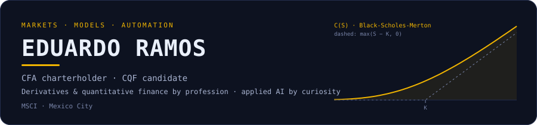
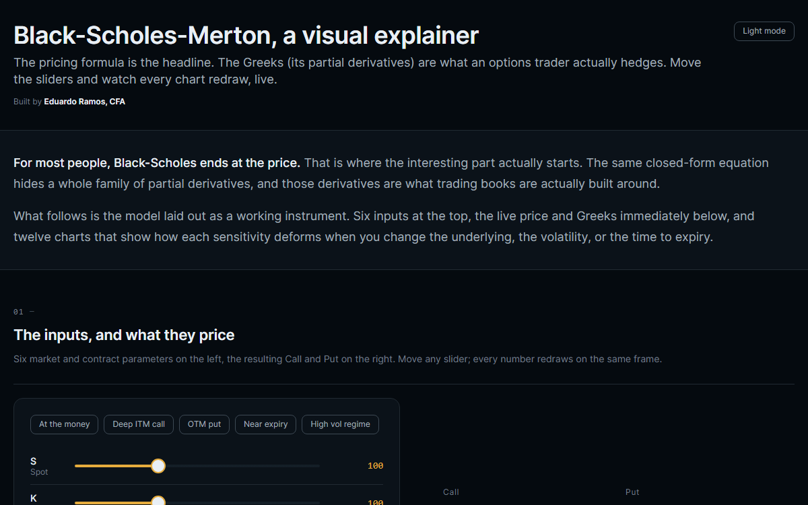
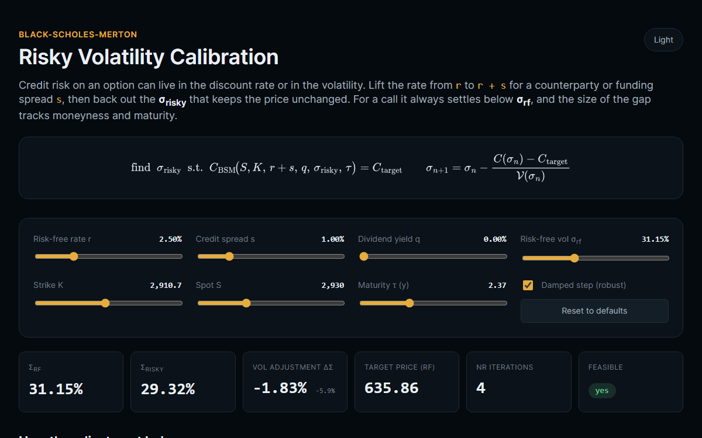
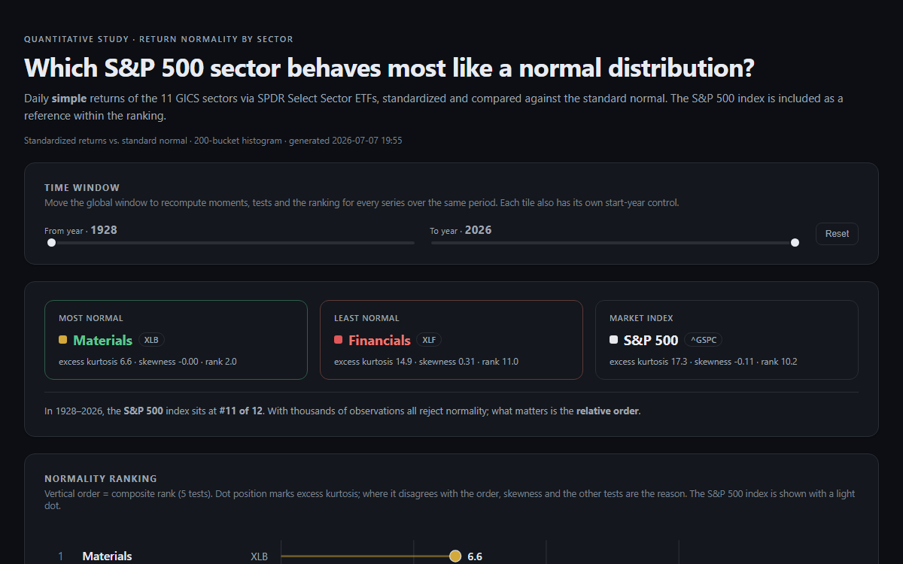
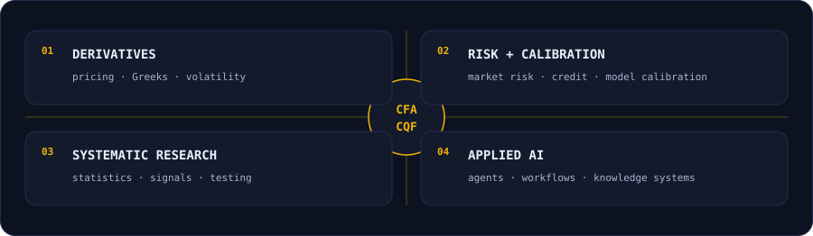
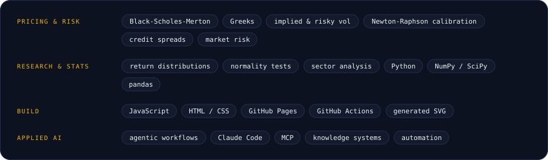
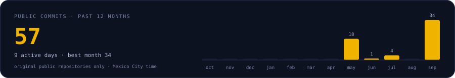

  

I'm **Eduardo Ramos**, CFA charterholder and CQF candidate, currently at **MSCI** in Mexico City. I work where derivatives, risk analytics, systematic research and applied AI meet, and I ship the models I study as small live tools.

<table>
  <tr>
    <td width="33%" valign="top">
      
       <b><a href="https://github.com/EERamos/bsm-calculator">bsm-calculator</a></b>
       European option prices and the full Greek set, redrawn live as you move the inputs.
       <a href="https://eeramos.github.io/bsm-calculator/">live app ↗</a> · derivatives · Greeks · JavaScript
    </td>
    <td width="33%" valign="top">
      
       <b><a href="https://github.com/EERamos/bsm-risky-calibration">bsm-risky-calibration</a></b>
       Back out the volatility that absorbs a credit or funding spread, via Newton-Raphson.
       <a href="https://eeramos.github.io/bsm-risky-calibration/">live app ↗</a> · credit risk · calibration · JavaScript
    </td>
    <td width="33%" valign="top">
      
       <b><a href="https://github.com/EERamos/sector-return-normality">sector-return-normality</a></b>
       All 11 S&amp;P 500 sectors ranked by how closely daily returns follow a normal distribution.
       <a href="https://eeramos.github.io/sector-return-normality/">live app ↗</a> · market statistics · time series · JavaScript
    </td>
  </tr>
</table>

<samp>[LinkedIn](https://www.linkedin.com/in/eduardo-ramosg/) · [GitHub](https://github.com/EERamos) · [BSM calculator](https://eeramos.github.io/bsm-calculator/) · [Risky vol calibration](https://eeramos.github.io/bsm-risky-calibration/) · [Sector normality](https://eeramos.github.io/sector-return-normality/)</samp>

Self-generated profile: SVG cards by <code>scripts/generate_profile.py</code> through GitHub Actions (daily), dashboard previews by <code>scripts/capture_previews.py</code>. Public-repository activity only.
