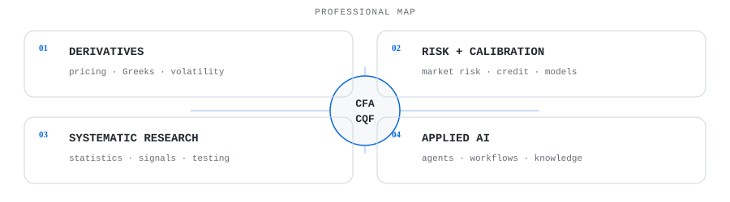
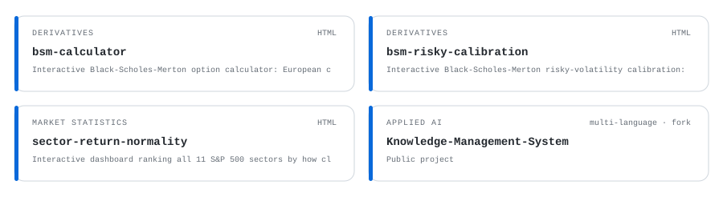
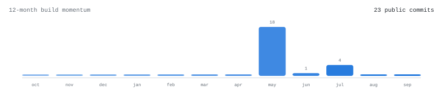
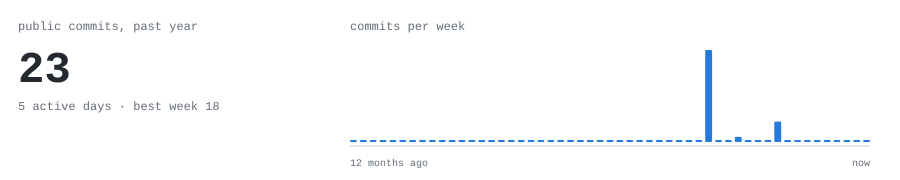
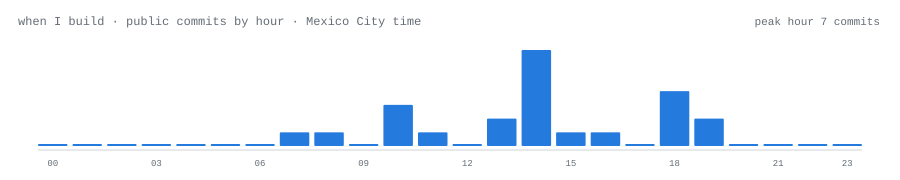
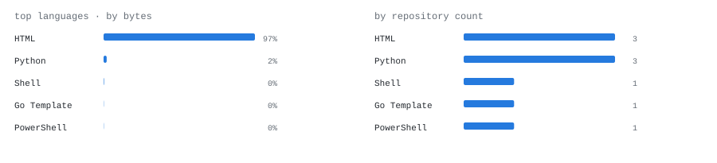
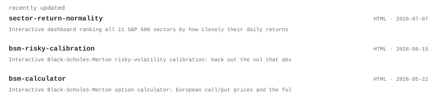

  

> Derivatives and quantitative finance by profession. Applied AI and agentic systems by curiosity.  
> The edge is where markets, models, and automation meet.

I'm **Eduardo Ramos — CFA charterholder and CQF candidate**, currently at **MSCI** in Mexico City. I work at the intersection of derivatives, quantitative finance, risk analytics, systematic investing, and applied AI.

This profile is deliberately self-contained: every visualization below is an SVG generated by this repository's own Python workflow from public GitHub data — no external stats cards or hosted widgets.

<samp>[LinkedIn](https://www.linkedin.com/in/eduardo-ramosg/) · [GitHub](https://github.com/EERamos)</samp>

Public-repository activity only. Profile graphics are generated daily by <code>scripts/generate_profile.py</code> through GitHub Actions.
